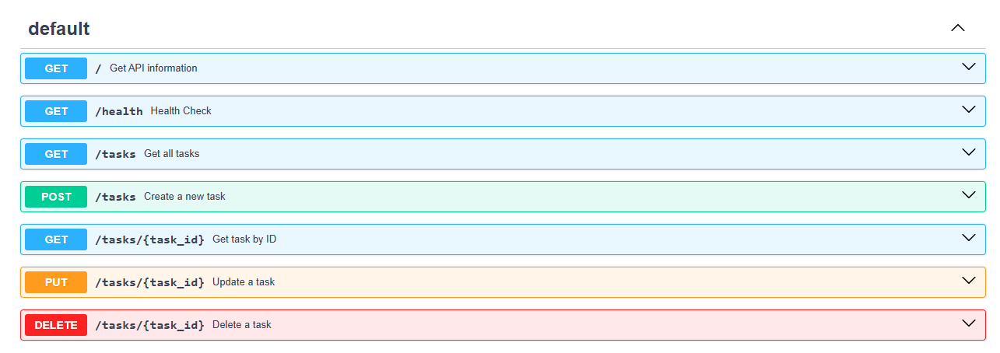
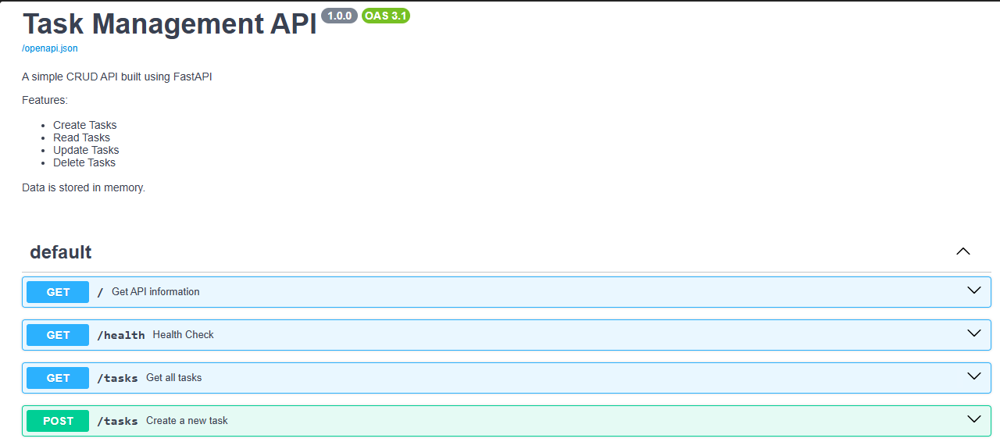
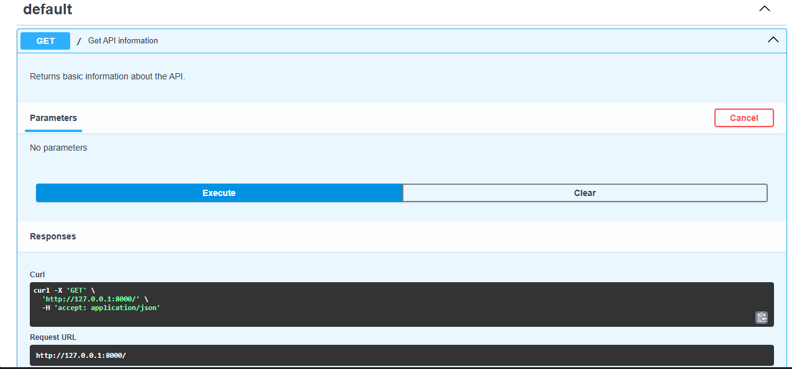
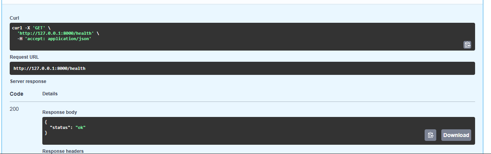
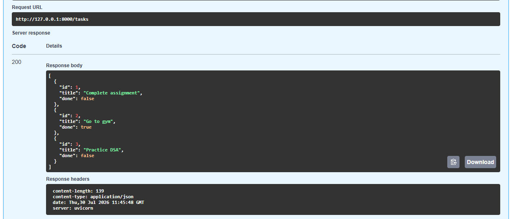
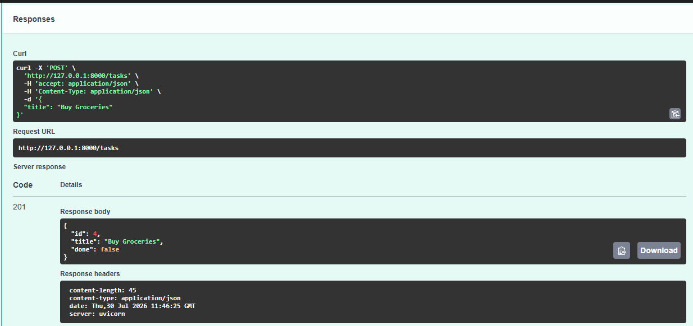
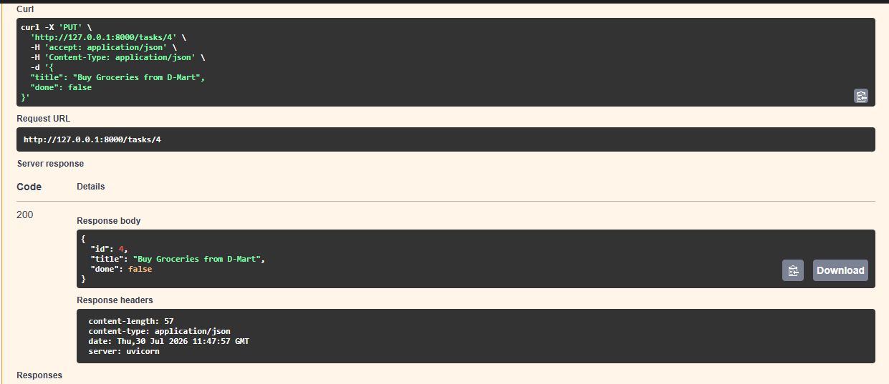
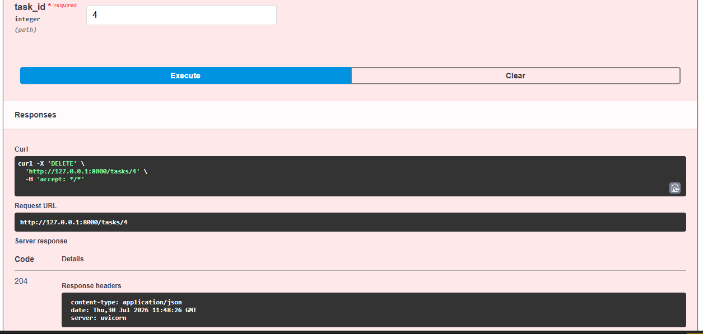

# Task Management API

A RESTful CRUD API built using **FastAPI** for managing tasks.

## Features

- Create Tasks
- Read Tasks
- Update Tasks
- Delete Tasks
- Interactive Swagger Documentation

---

## Tech Stack

- Python 3
- FastAPI
- Uvicorn
- Pydantic

---

## Installation

Clone the repository

```bash
git clone https://github.com/crazyluhsnap/task-api
```

Move into project

```bash
cd CRUD API
```

Install dependencies

```bash
pip install -r requirements.txt
```

Run server

```bash
uvicorn app:app --reload
```

Open

```
http://127.0.0.1:8000/docs
```

---

## API Endpoints



---

## Sample Request

```bash
curl -X POST http://127.0.0.1:8000/tasks \
-H "Content-Type: application/json" \
-d "{\"title\":\"Buy groceries\"}"
```

Response

```json
{
    "id":4,
    "title":"Buy groceries",
    "done":false
}
```

---

## Swagger UI

(Add your screenshot here)









---

